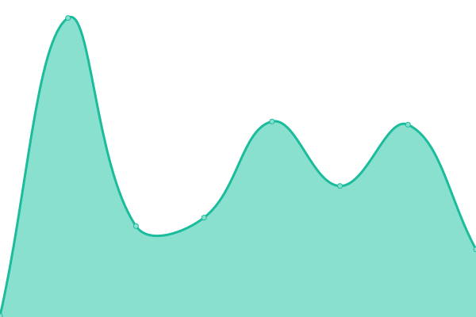

# [📈 Live Status](https://vniba.github.io/status): <!--live status--> **🟩 All systems operational**

This repository contains the open-source uptime monitor and status page for [vn!ba](https://vniba.github.io/status), powered by [Upptime](https://github.com/upptime/upptime).

With [Upptime](https://upptime.js.org), you can get your own unlimited and free uptime monitor and status page, powered entirely by a GitHub repository. We use [Issues](https://github.com/vniba/status/issues) as incident reports, [Actions](https://github.com/vniba/status/actions) as uptime monitors, and [Pages](https://vniba.github.io/status) for the status page.

<!--start: status pages-->
<!-- This summary is generated by Upptime (https://github.com/upptime/upptime) -->
<!-- Do not edit this manually, your changes will be overwritten -->
<!-- prettier-ignore -->
| URL | Status | History | Response Time | Uptime |
| --- | ------ | ------- | ------------- | ------ |
|  [darkweb](https://darkweb-rho.vercel.app/) | 🟩 Up | [darkweb.yml](https://github.com/vniba/status/commits/HEAD/history/darkweb.yml) | 

 180ms
     
 | 

<a href="https://vniba.github.io/status/history/darkweb">100.00%</a>
    

|  zenoa | 🟩 Up | [zenoa.yml](https://github.com/vniba/status/commits/HEAD/history/zenoa.yml) | 

 1767ms
     
 | 

<a href="https://vniba.github.io/status/history/zenoa">99.49%</a>
    

|  [gamehub](https://web-dev-f5367.web.app/) | 🟩 Up | [gamehub.yml](https://github.com/vniba/status/commits/HEAD/history/gamehub.yml) | 

 130ms
     
 | 

<a href="https://vniba.github.io/status/history/gamehub">100.00%</a>
    

|  [sambar](https://sambar.netlify.app/) | 🟩 Up | [sambar.yml](https://github.com/vniba/status/commits/HEAD/history/sambar.yml) | 

 124ms
     
 | 

<a href="https://vniba.github.io/status/history/sambar">100.00%</a>
    

<!--end: status pages-->

[**Visit our status website →**](https://vniba.github.io/status)

## 📄 License

- Powered by: [Upptime](https://github.com/upptime/upptime)
- Code: [MIT](./LICENSE) © [Anand Chowdhary](https://anandchowdhary.com), supported by [Pabio](https://pabio.com)
- Data in the `./history` directory: [Open Database License](https://opendatacommons.org/licenses/odbl/1-0/)
